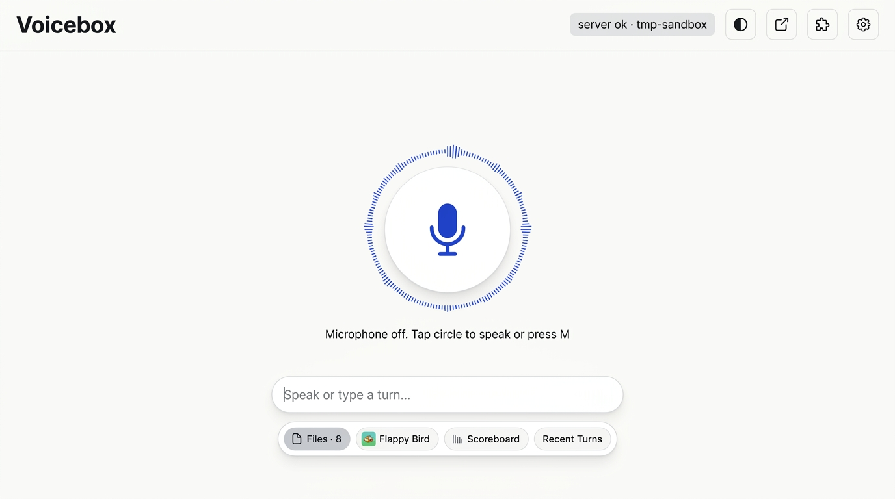
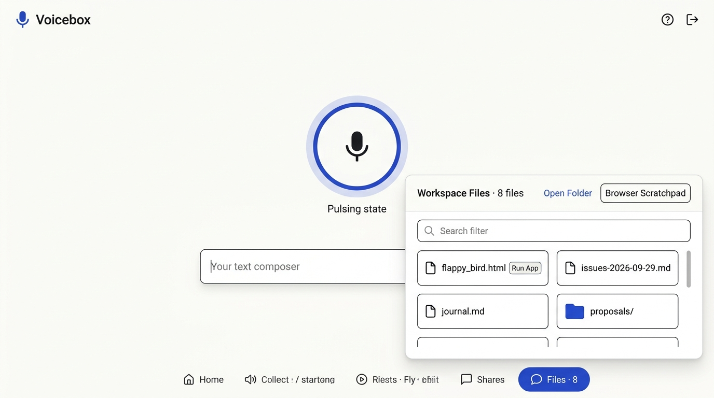
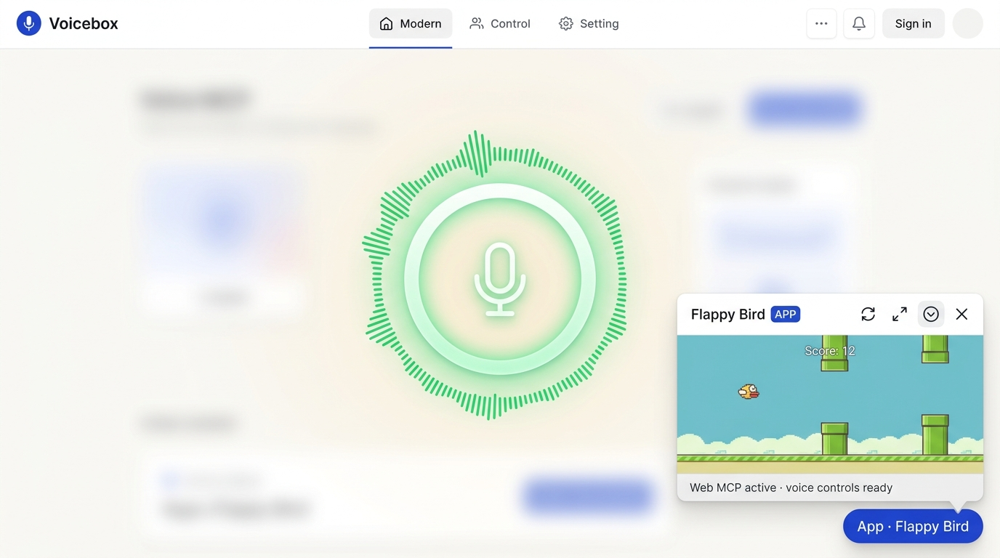

# Voicebox UX Design Explorations & Nano Banana Prototypes

This folder (`designs/`) contains the root-cause UX audit, Nano Banana visual mockups, interactive HTML prototype, and mockup generator script for redesigning the Voicebox room interface around a **Warm Tactile Paper Light Mode**, a **Centered Hero Microphone Stage**, and a **Floating Bubble Tray with On-Demand Popover Cards**.

---

## 1. Visual Mockups (Gemini Nano Banana)

### 01 — Warm Light Hero Stage & Floating Bubble Tray (`Home`)



### 02 — Files Bubble Popover Card (`Files`)



### 03 — Real Mini-App Floating Popover Window



---

## 2. Root-Cause Audit of the Previous UI

### 2.1 Forced Dark Slate Theme (`#0b0f19`)
- **Why it felt bad**: `public/index.html` hardcoded `data-theme="dark"` on `<html>`, and `public/sqeh-deck.css` overrode the room palette with heavy dark-slate glass (`#0b0f19` background, `rgba(15, 23, 42, 0.72)` cards, `#f8fafc` text) regardless of user preference. The result felt brooding, high-glare in daylight, and visually disconnected from Voicebox's original tactile paper tokens (`public/style.css`).
- **The Fix**:
  - Default `<html>` to `data-theme="light"` using the **Warm Tactile Paper** palette:
    - `--ground: #fbfbf9` (warm off-white paper canvas)
    - `--card: #ffffff` (crisp elevated surface with subtle `1px solid rgba(35, 38, 43, 0.10)` hairlines and soft ambient shadow)
    - `--ink: #23262b` / `--muted: #5a6069` (high-contrast legible typography)
    - `--accent: #1f3fd0` (cobalt focus & interactive ring)
    - `--good: #1d6b32` (emerald listening & live indicators)
  - Provide an explicit `#theme-toggle` button in the header (`☀️ Light` / `🌙 Dark`) persisted in `localStorage.getItem('voicebox.theme')`, keeping dark mode purely opt-in (`html[data-theme="dark"]`).

### 2.2 Microphone Pushed Off-Centre Below the Fold
- **Why it happened**: In `public/index.html`, `<section class="made" id="made-list">` (a 720px-wide inline file browser and breadcrumb tree) was placed *above* `<section class="voice">` in DOM flow, and a giant multi-row inline `<section id="sqeh-deck">` dashboard sat immediately underneath. Together they shoved the primary `#mic` button down the page so the user had to hunt for the microphone.
- **The Fix**:
  - Promote `<section class="voice">` to the **permanent Hero Stage** at the visual center of the viewport (`min-height: 46vh`, centered flex column).
  - Elevate `#mic` to a `116px × 116px` tactile circular centerpiece with an animated breathing/speaking ring, keyboard shortcut badge (`M`), live status pill (`Ready — tap or press M`), and a clean pill composer (`#say-form`) directly below.

### 2.3 File List as a Floating Bubble + On-Demand Popover Card
- **Why it felt cluttered**: Rendering every workspace folder and file inline at the top of the room created a permanent wall of text before the user even spoke a word, and duplicated the file list again inside `#sqeh-quick-files`.
- **The Fix**:
  - Replace the permanent inline file wall with a compact **`📁 Files · N` pill bubble** inside the **Floating Bubble Tray** directly beneath the composer.
  - Clicking the `Files` bubble (or pressing `Files` in the dock) opens `#made-list` as a centered **Floating Popover Card** (`max-width: 680px`, `max-height: 68vh`, backdrop blur, instant filter search, 2-column compact file grid, and a `×` close button or `Esc` to dismiss).

### 2.4 Distinct `Home` vs `Files` vs `History` vs `Controls` States
- **Why `Home` and `Files` looked identical**: Previously, `[data-mobile-view]` CSS rules only applied inside `@media (max-width: 768px)`, so clicking `Home` (`deck`) vs `Files` (`files`) on desktop changed nothing on screen. Furthermore, both views rendered the exact same workspace file list twice.
- **The New State Matrix**:

| Active State (`data-mobile-view`) | Hero Voice Stage (`#mic` + `#say-form`) | Floating Bubble Tray | Active Floating Popover Card |
| :--- | :--- | :--- | :--- |
| **`deck` (`Home`)** | Centered & primary | Visible below composer | None (clean, distraction-free voice stage) |
| **`files` (`Files`)** | Centered in background | `📁 Files` bubble highlighted | **Files Explorer Popover** (`#made-list`) |
| **`transcript` (`History`)** | Centered in background | `💬 Recent Turns` bubble highlighted | **Recent Turns & Artifacts Popover** (`#sheet` / `#sqeh-history-card`) |
| **`controls` (`Controls`)** | Centered in background | `🎛️ Controls` bubble highlighted | **Audio & System Controls Popover** (Mute, Volume, Workspace Root) |

### 2.5 Real Mini-App Bubbles (No Fake Buttons) + Popover & Scroll Fix
- **Why "Mini-Apps" felt broken**:
  1. The previous `#sqeh-deck` hardcoded four static tiles under "Mini-Apps & Controls": `Mute Mic`, `Volume Up`, `Spotify` (which just sent a chat prompt), and `File Explorer` (which just scrolled to `#made-list`). None of them were actual mini-apps!
  2. Real `.html` mini-apps in the workspace (like `flappy_bird.html`) had no dedicated bubbles in the tray.
  3. When a mini-app was opened via `/Work/...`, `server.mjs` prepended `<script src="/public/voicebox-sdk.js"></script>` *before* `<!DOCTYPE html>`, forcing the iframe into **Quirks Mode** and breaking `height: 100%` / flex / canvas sizing, while `.sqeh-miniapp-body { overflow: hidden }` prevented scrolling inside taller apps.
- **The Fix**:
  - **Real Mini-App Bubbles**: Automatically populate the Floating Bubble Tray with pill bubbles for real `.html` apps discovered in the workspace (`🕹️ Flappy Bird`, `📊 Scoreboard`, etc.) plus any mini-apps launched via the `launch_mini_app` Web MCP tool, alongside a `🚀 Launch App` action inside the Files popover.
  - **Standards-Mode SDK Injection**: Inject `<script src="/public/voicebox-sdk.js"></script>` *after* `<!DOCTYPE html>` (inside `<head>` or after `<html>`) so mini-app iframes always render in Standards Mode.
  - **Scrollable Floating Mini-App Popover**: Render `#sqeh-miniapp-stage` as a centered floating popover window (`width: min(92vw, 680px)`, `height: min(78vh, 620px)`) with `overflow: auto` on the body, plus **Reload (`↻`)**, **Expand (`⤢`)**, **Collapse to Floating Bubble (`—`)**, and **Close (`×`)** controls.

---

## 3. Interactive HTML Prototype (`designs/prototype.html`)

Open `designs/prototype.html` directly in any browser to test the redesigned room interactions before or alongside production changes:

```sh
open designs/prototype.html
```

### What You Can Test in `designs/prototype.html`:
- **Warm Paper Light Mode & Instant Theme Toggle**: Click `☀️ Light` / `🌙 Dark` in the top-right header to compare the default Warm Paper palette against the optional Dark theme.
- **Centered Hero Microphone (`M`)**: Click the central mic button or press `M` to cycle through **Ready → Listening (animated emerald waveform ring) → Speaking**.
- **Floating Bubble Tray**:
  - Click **`📁 Files · 8`** to pop over the **Workspace Files Card** with live search filtering, folder navigation chips, and **`Run App`** buttons on `.html` files.
  - Click **`🕹️ Flappy Bird`** or **`📊 Scoreboard`** to pop over a live interactive **Mini-App Popover Window** (including a playable Flappy Bird canvas mini-game!), and test **Expand (`⤢`)**, **Minimize to corner bubble (`—`)**, and **Close (`×`)**.
  - Click **`💬 Recent Turns · 4`** to pop over the **Session History & Artifacts** card.
  - Click **`🎛️ Controls`** to pop over **Audio & Room Controls** (Mute Mic, Volume slider, Server status).
- **Bottom Pill Dock Synchronization**: Switching between `Home`, `Files`, `History`, and `Controls` in the bottom pill dock stays 100% synchronized with the Floating Bubble Tray and `Esc` / backdrop dismissal.

---

## 4. Generating New Mockups (`designs/generate-mockups.mjs`)

You can generate additional UI concept explorations at any time using `designs/generate-mockups.mjs`, which calls the Gemini Nano Banana image generation model (`gemini-2.5-flash-image`) using `GEMINI_API_KEY` from your environment or `.env`:

```sh
node designs/generate-mockups.mjs \
  "Clean tactile light mode voice assistant web app with a floating audio waveform modal" \
  designs/04-custom-concept.png
```
