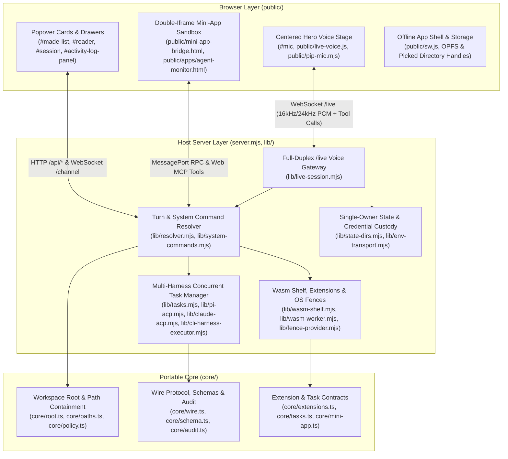
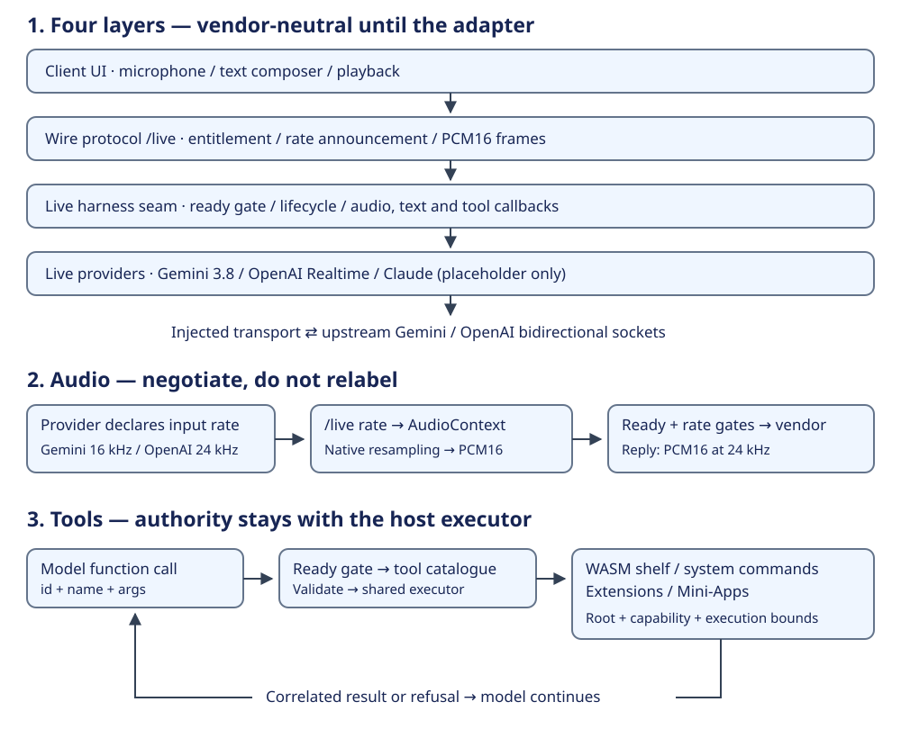
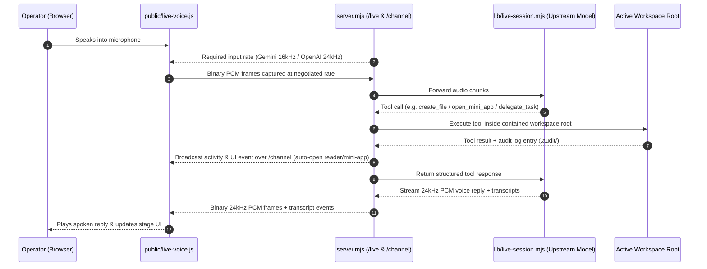
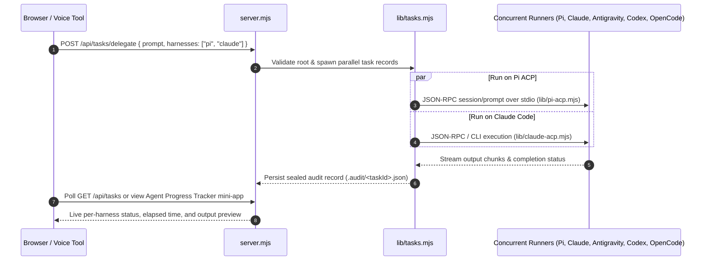

# Voicebox Architectural Overview

Voicebox is a **local-first, full-duplex voice and browser workspace** for creating files, running sandboxed tools, building interactive Web MCP Mini-Apps, and delegating engineering tasks concurrently across external coding harnesses.

This document provides the high-level architectural overview of the system, its core design principles, end-to-end execution flows, and module ownership map. For detailed auto-generated runtime tables of routes, live models, and environment variables, see [`07-architecture.md`](07-architecture.md).

---

## 1. Executive Summary & Core Design Principles

Voicebox is architected around five foundational invariants:

1. **Voice-First Full-Duplex Workspace on `127.0.0.1`**:
   - Both the Vite development UI server and the Node.js HTTP/WebSocket host (`server.mjs`) bind strictly to loopback (`127.0.0.1`).
   - Audio is captured in the browser via an `AudioWorklet` (`public/pcm-worklet.js`) and streamed bi-directionally over the `/live` WebSocket (`lib/live-session.mjs`) to low-latency realtime voice models (Gemini Live and OpenAI Realtime; Claude's live adapter is a placeholder).
2. **Explicit Workspace Root Containment (`core/root.ts`)**:
   - Every file read, write, audit record, and task delegation runs inside an explicitly declared workspace root (`core/root.ts`).
   - Path resolution (`core/paths.ts`) rejects any relative path or `..` traversal that leaves the active root; the machine placement's `realpath` pass (existing-ancestor walk-up), dotfile denial and root-kind handling live in exactly one owner (`lib/path-auth.mjs`), enforced statically by `scripts/single-owner.mjs`.
3. **Single-Owner State Facts (`lib/state-dirs.mjs`)**:
   - Host state directories (`HOST_DIR`, `SANDBOX_ROOTS_DIR`, `HARNESS_CONFIG_DIR`, `MINI_APPS_DIR`) are computed in exactly one module (`lib/state-dirs.mjs`) and enforced statically by `scripts/single-owner.mjs` — which also enforces the single computing site for path authorization (`lib/path-auth.mjs`, declared as code-shape `SITES`).
4. **Host-Held Credential Custody**:
   - Provider API keys (`.api-keys.json`), host tokens (`.host-token`), and remote pairing bearers (`.pairings.json`) are stored with `0600` permissions inside `HOST_DIR` outside every project workspace root. Browser JavaScript and sandboxed child processes never receive raw credentials.
5. **Plain-Language, Zero-Shift UI**:
   - The browser room (`public/index.html`, `public/fused.js`, `public/style.css`) keeps the microphone at the center of the stage while surfacing files, diffs, mini-apps, and live agent progress in non-blocking popovers and docked drawers. Every refusal names the exact rule and recovery action in plain English (`tools/rendered-plain-language.mjs`).
   - The agent's own contour (`.output-ring path`) is a followed, seam-free meter (voicebox-beads-u03k): each painted radius chases the audio with a fast attack and a slower decay, so a pause eases over ~20 frames instead of collapsing the whole amplitude in one (measured: 13.0 units in a single frame before the change), and the ring's history is traversed mirrored, so the oldest and newest entries are never drawn adjacent (measured: a 9.5-unit step at that wrap before). The data-driven phase and its carrier stay, so a steady note still moves; `tests/mic-waveform-animation.test.mjs` drives the real renderer with a wrap-only fixture, a loud→silent step, and a constant input, and asserts all three.

---

## 2. High-Level System Architecture

Voicebox is structured into three cleanly separated layers: the **Browser Layer** (`public/`), the **Portable Core** (`core/`), and the **Host Server & Capability Layer** (`server.mjs`, `lib/`).



### Live-model layering

The reusable public entry point is `lib/live-harness.mjs`; it does not start a UI or HTTP server. Four live-path layers keep vendor protocols below the loop and tool authority in the host:

```text
Client UI -> Wire protocol (/live) -> Live harness seam -> Live providers
                                        |                  Gemini 3.8 / OpenAI
                                        |                  Claude: placeholder
                                        |                       |
                                        v                       v
                                  Shared tool executor    Vendor bidi sockets
```



[Pluggable live models](23-pluggable-live-models.md) specifies the provider interface, Gemini 3.8 Thinking budget, OpenAI GA setup, rate negotiation, and bounded tool roundtrip. Library callbacks carry output rate; the current browser wire plays the implemented vendors' 24 kHz output.

### 2.1 Browser Layer (`public/`)

- **Centered Hero Voice Stage**:
  - `#mic` sits in the center of the viewport with concentric canvas frequency rings (`#freq-rings`) driven by live input/output audio analyser nodes (`public/live-voice.js`, `public/audio-client.js`).
  - Supports a floating **Document Picture-in-Picture (PiP) Microphone** (`public/pip-mic.mjs`) so voice controls remain visible and interactive while working in other windows, plus an installable **PWA Service Worker** (`public/sw.js` and `public/manifest.webmanifest`).
- **Popover Cards & Real-Time Activity Drawers**:
  - **Files Popover (`#made-list`) & Reader (`#reader`)**: Displays files created or updated in the active root and opens them in an interactive drawer with edit/save support (`PUT /api/file`).
  - **Recent Turns (`#session`) & Activity Log (`#activity-log-panel`)**: Streams real-time voice transcripts, tool invocations, and file mutations over `/channel` and `GET /api/activity`.
- **Double-Iframe Mini-App Sandbox & Agent Progress Tracker**:
  - Interactive HTML/JS tools (`public/mini-app-bridge.html`, `public/mini-app-bridge.js`, `public/mini-app-sdk.js`) run inside an outer `/mini-app-bridge.html` host frame and an inner `sandbox="allow-scripts"` iframe with a strict `Content-Security-Policy` (`default-src 'none'`).
  - Mini-apps register callable tools dynamically via `window.webMcp.register(name, description, schema, handler)`.
  - Includes the built-in **Agent Progress Tracker** (`public/apps/agent-monitor.html`, `lib/agent-monitor-app.mjs`) for monitoring concurrent coding agents, viewing live task output, and cancelling tasks.

### 2.2 Host Server Layer (`server.mjs`, `lib/`)

- **Full-Duplex `/live` Voice Bridge (`lib/live-session.mjs`)**:
  - Bridges browser PCM audio to Gemini Live (`lib/live-providers/gemini.mjs`) or OpenAI Realtime (`lib/live-providers/openai.mjs`); `lib/live-providers/claude.mjs` currently refuses live audio/text as unimplemented.
  - Routes tool calls through `onToolCall` to the host's shared executor, which validates the active workspace root and returns structured results; providers never execute tools themselves.
- **Turn & System Command Resolver (`lib/resolver.mjs`, `lib/system-commands.mjs`)**:
  - Resolves spoken or typed turns into structured verbs: `write`, `read`, `list`, `call` (extension/Wasm/mini-app tool), `delegate` (coding harness task), `system` (clipboard, theme, panel navigation, mute/interrupt), or `say`.
- **Multi-Harness Concurrent Task Delegation (`lib/tasks.mjs`)**:
  - Supports simultaneous connections and parallel task execution across **Pi** (`lib/pi-acp.mjs`), **Claude Code** (`lib/claude-acp.mjs`), **Antigravity**, **Codex**, and **OpenCode** (`lib/cli-harness-executor.mjs`).
  - Operators can configure multiple ready harnesses (`GET /api/harnesses`, `PUT /api/harnesses/active`) and fan out tasks in parallel (`POST /api/tasks/delegate` with `harnesses: [...]` or `harness: "all"`).
- **Sandboxed Execution & Extensions (`lib/wasm-shelf.mjs`, `core/extensions.ts`, `lib/fence-provider.mjs`)**:
  - Runs digest-pinned `.wasm` tools inside isolated Node `worker_threads` (`lib/wasm-worker.mjs`) with `resourceLimits` and hard timeouts.
  - Stages and admits extension packages (`lib/extensions.mjs`, `lib/extension-approval.mjs`) after verifying declared capabilities against the environment tier ceiling (`core/tier-table.ts`).
  - Enforces OS-level filesystem and process isolation (`tools/fence.sh`, `tools/fence-unit.sh`) on Linux (`bwrap`/`prlimit`) and macOS (`sandbox-exec`).

---

## 3. End-to-End Execution Flows

### 3.1 Flow 1: Live Full-Duplex Voice Turn & Tool Execution

When the user speaks with the microphone active, audio streams over `/live` and tool calls execute in-process against the active workspace root while broadcasting real-time UI updates over `/channel`:



### 3.2 Flow 2: Multi-Harness Parallel Task Delegation

Voicebox can delegate a task to one or several coding agent harnesses concurrently (via voice tool call `delegate_task` or `POST /api/tasks/delegate`):



### 3.3 Flow 3: Deterministic Browser System Commands

Spoken or typed system commands (`copy`, `paste`, `open files`, `open agent tracker`, `dark mode`, `stop speaking`, `clear activity log`) are matched deterministically by `lib/system-commands.mjs` with zero model latency:

1. `parseSystemCommand(transcript)` in `lib/system-commands.mjs` parses the phrase into `{ verb: "system", command, target, text, file, mode }`.
2. `execute(action)` in `server.mjs` records the event in the activity log and broadcasts `{ type: "system_command", ... }` over `/channel`.
3. `applySystemCommand(cmd)` in `public/fused.js` performs the browser action immediately (copying to `navigator.clipboard`, toggling `[data-theme]`, opening the target popover or Agent Progress Tracker mini-app, or interrupting audio playback).

---

## 4. Module Ownership Map

| Directory / File | Responsibility | Key Modules |
|---|---|---|
| `server.mjs` | HTTP & WebSocket loopback host, route handlers, `/live` and `/channel` upgrade gates, and turn execution coordinator. | `server.mjs` |
| `core/` | Runtime-agnostic TypeScript contracts, workspace root containment, capability policy, wire envelopes, and audit records. | `core/root.ts`, `core/paths.ts`, `core/policy.ts`, `core/tier-table.ts`, `core/wire.ts`, `core/extensions.ts`, `core/tasks.ts`, `core/mini-app.ts`, `core/audit.ts`, `core/environment.ts`, `core/fleet.ts` |
| `lib/` | Host capabilities: state directory ownership, live voice providers, turn & system command resolvers, multi-harness ACP/CLI runners, Wasm worker shelf, mini-app store, and OS sandboxing. | `lib/state-dirs.mjs`, `lib/live-session.mjs`, `lib/resolver.mjs`, `lib/system-commands.mjs`, `lib/tasks.mjs`, `lib/pi-acp.mjs`, `lib/claude-acp.mjs`, `lib/cli-harness-executor.mjs`, `lib/wasm-shelf.mjs`, `lib/wasm-worker.mjs`, `lib/mini-app-host.mjs`, `lib/mini-app-store.mjs`, `lib/agent-monitor-app.mjs`, `lib/fence-provider.mjs` |
| `public/` | Browser room UI, WebSocket audio client, PCM `AudioWorklet`, PiP mic, double-iframe mini-app bridge, and PWA Service Worker. | `public/index.html`, `public/fused.js`, `public/style.css`, `public/live-voice.js`, `public/audio-client.js`, `public/pcm-worklet.js`, `public/pip-mic.mjs`, `public/mini-app-bridge.html`, `public/mini-app-bridge.js`, `public/apps/agent-monitor.html`, `public/sw.js` |
| `tools/` | OS sandbox wrappers, Wasm build pipeline, harness discovery CLI, and live page acceptance checks. | `tools/fence.sh`, `tools/fence-unit.sh`, `tools/build-wasm.mjs`, `tools/list-harnesses.mjs`, `tools/page-acceptance.mjs`, `tools/rendered-plain-language.mjs` |
| `scripts/` | Documentation drift generator/verifier, single-owner static check, and pre-push gate orchestration. | `scripts/docs-check.mjs`, `scripts/docs-touched.mjs`, `scripts/single-owner.mjs`, `scripts/test-lanes.mjs`, `scripts/pre-push.sh` |
| `tests/` | Concurrent `unit` tests and isolated `live` end-to-end integration suites. | `tests/docs-drift.test.mjs`, `tests/single-owner.test.mjs`, `tests/system-commands.test.mjs`, `tests/multi-harness-execution.test.mjs`, `tests/agent-monitor-miniapp.test.mjs` |
