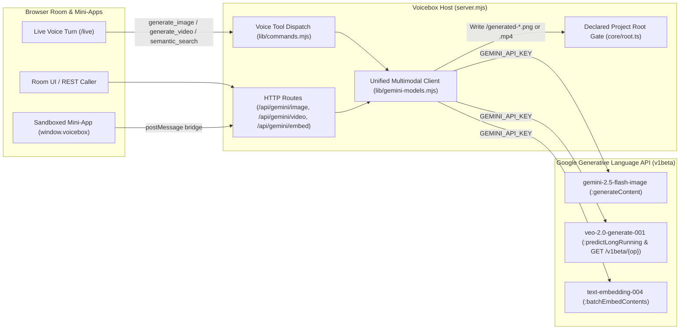

# Gemini Multimodal Platform Plan

When a Voicebox host holds `GEMINI_API_KEY`, the same credential that powers full-duplex voice over `/live` (`lib/live-providers/gemini.mjs`) and text-turn resolution (`lib/resolver.mjs`) also unlocks the broader Google Gemini multimodal model family. `lib/gemini-models.mjs` provides a unified, zero-dependency host client for image generation and editing, asynchronous Veo video generation, vector embeddings with cosine semantic search, and search-grounded reasoning.

## 1. Model Capability Matrix

| Capability | Primary Models | Upstream Endpoint | Voicebox Integration Seam | Output / Artifact |
|---|---|---|---|---|
| **Real-Time Voice & Vision (`/live`)** | `models/gemini-3.8-live`, `gemini-2.5-flash-native-audio` | `BidiGenerateContent` WebSocket (`lib/live-providers/gemini.mjs`) | Full-duplex 16 kHz PCM16 audio input, 24 kHz audio output, live tool calling (`lib/commands.mjs`) | Streamed PCM16 audio frames + correlated tool responses |
| **Image Generation & Editing (Nano Banana / Imagen)** | `gemini-2.5-flash-image`, `imagen-3.0-generate-002` | `POST /v1beta/models/{model}:generateContent` (`responseModalities: ["TEXT", "IMAGE"]`) and `:predict` | `generateGeminiImage` in `lib/gemini-models.mjs` | Base64 + `Buffer` PNG/JPEG written to `<root>/generated-*.png`, immediately visible in the **Files** popover and Mini-Apps |
| **Video Generation (Veo)** | `veo-2.0-generate-001`, `veo-3.0-generate-preview` | `POST /v1beta/models/{model}:predictLongRunning` + `GET /v1beta/{operationName}` | `startGeminiVideoGeneration` & `pollGeminiVideoOperation` in `lib/gemini-models.mjs` | Async operation tracked in the activity / task card feed without blocking voice turns; downloads MP4 to `<root>/generated-*.mp4` on completion |
| **Embeddings & Semantic Search** | `text-embedding-004`, `gemini-embedding-001` | `POST /v1beta/models/{model}:batchEmbedContents` & `:embedContent` | `embedGeminiTexts`, `cosineSimilarity`, and `semanticSearchDocuments` in `lib/gemini-models.mjs` | Configurable `taskType` (`RETRIEVAL_DOCUMENT`, `RETRIEVAL_QUERY`, `CODE_RETRIEVAL_QUERY`) and `outputDimensionality` for natural-language file discovery |
| **Search Grounding & Deep Reasoning** | `gemini-2.5-flash`, `gemini-2.5-pro` | `POST /v1beta/models/{model}:generateContent` (`tools: [{ googleSearch: {} }]`, `thinkingConfig`) | Host grounded-query helper alongside `lib/gemini-models.mjs` | Cited web synthesis and multi-step reasoning returned to the room or active Mini-App |

---

## 2. Architecture & Voice / API Seam

All multimodal requests route through the host process so `GEMINI_API_KEY` remains in host custody (`server.mjs`) and never reaches browser scripts or sandboxed Mini-App iframes. Every generated asset or semantic search read is gated by the active project root boundary (`core/root.ts`).



---

## 3. Core Workflows & Module Contract (`lib/gemini-models.mjs`)

### A. Capability Discovery (`listGeminiCapabilities`)
- Inspects whether `GEMINI_API_KEY` is present in the host environment or credential store.
- Returns `{ ok: true, configured, capabilities }` enumerating `liveAudioVideo`, `imageGeneration`, `videoGeneration`, `embeddings`, and `searchGrounding` with their default models and endpoints.

### B. Conversational Image Generation & Multi-Image Editing (`generateGeminiImage`)
- Invokes `gemini-2.5-flash-image` via `:generateContent` with `generationConfig: { responseModalities: ["TEXT", "IMAGE"], imageConfig: { aspectRatio } }`.
- Accepts optional `referenceImages` (`[{ mimeType, data }]`) so a user or Mini-App can pass existing project images for conversational editing or style transfer.
- Extracts `inlineData` (`mimeType`, base64 `data`, decoded `bytes` `Buffer`) and any accompanying text caption, ready to be persisted into `<root>/generated-*.png` and audited in the room log.

### C. Long-Running Video Generation (`startGeminiVideoGeneration` & `pollGeminiVideoOperation`)
- Starts generation via `veo-2.0-generate-001` (`:predictLongRunning`) with `{ instances: [{ prompt }], parameters: { aspectRatio, durationSeconds } }`.
- Returns `{ ok: true, model, operationName, done, status }` immediately so the voice session can acknowledge the request and keep conversing.
- Polls `GET /v1beta/{operationName}` (strictly validating that `operationName` begins with `operations/` or `models/` and contains no path traversal segments) until `done: true`, returning `status: "completed"` and the resolved `videoUri` for download into `<root>/generated-*.mp4`.

### D. Embeddings & Workspace Semantic Search (`embedGeminiTexts` & `semanticSearchDocuments`)
- Calls `:batchEmbedContents` on `text-embedding-004` (or `gemini-embedding-001`) with `taskType` (`RETRIEVAL_QUERY`, `RETRIEVAL_DOCUMENT`, or `CODE_RETRIEVAL_QUERY`) and optional `outputDimensionality`.
- `semanticSearchDocuments` embeds the natural-language query with `RETRIEVAL_QUERY` and workspace documents (`[{ id, title, text }]`) with `RETRIEVAL_DOCUMENT`, scores each candidate using `cosineSimilarity`, and returns the top-K ranked files. Asking *"Find the file where we talked about authentication"* locates the matching file even when the query shares no exact keywords with the file's text.

---

## 4. Verification

`tests/gemini-models.test.mjs` runs in the concurrent `unit` test lane using deterministic `fetchImpl` stubs and zero paid network requests:

```sh
node scripts/single-owner.mjs
node scripts/test-lanes.mjs --check
node --test tests/gemini-models.test.mjs
```
